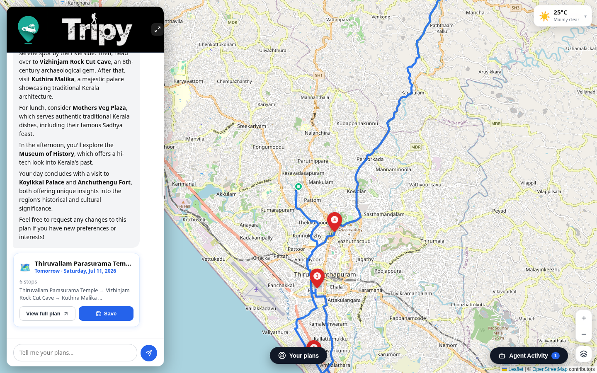
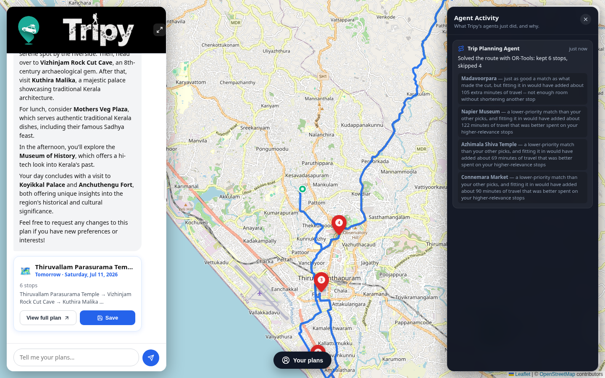
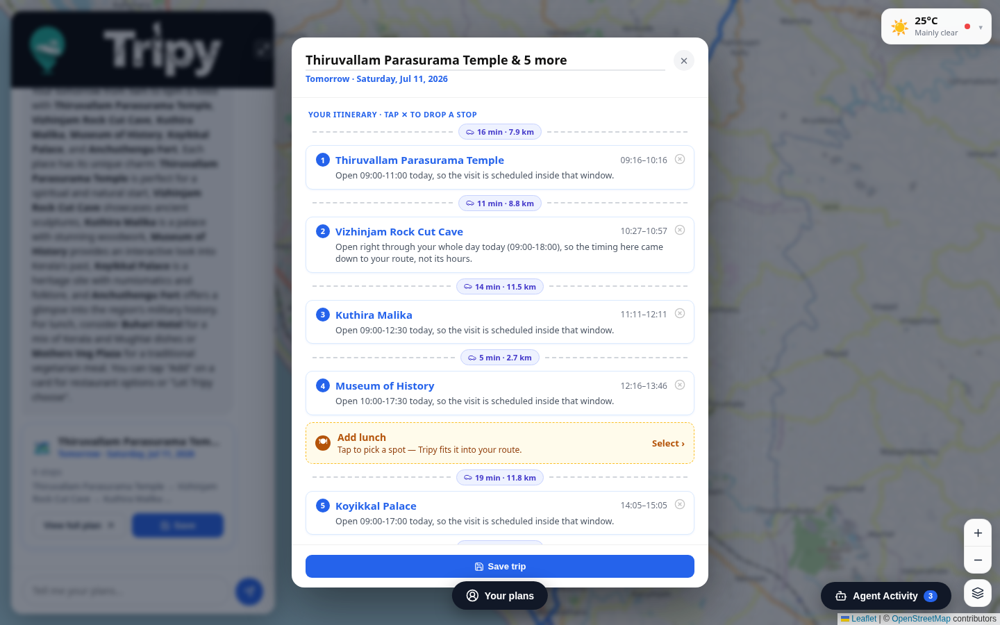

<div align="center">


# Tripy

**An AI trip planner that plans a real day, watches it happen, and tells you why it made every call.**

Chat in plain English → get a timed, road-routed itinerary built by a constraint solver, not a guess.
Three background agents then watch the plan against live weather and your actual pace, and a live panel shows their reasoning as it happens.

[](https://www.python.org/)
[](https://fastapi.tiangolo.com/)
[](https://react.dev/)
[](https://www.langchain.com/langgraph)
[](https://developers.google.com/optimization)
[](https://www.trychroma.com/)

</div>

---

## What this actually is

Most "AI trip planner" projects are a single prompt to an LLM that hallucinates an itinerary. Tripy isn't that. The LLM's only job is to hold a conversation and extract what the traveller wants — every itinerary decision (what fits, in what order, at what time, with what trade-off) is made by a real optimizer over real data:

- **Retrieval, not invention.** Every place recommendation comes from a semantic search (Chroma + sentence-transformers) over a curated dataset of 65 real Trivandrum landmarks and restaurants, each with real visitor-review text, opening hours, and vibe tags — the LLM describes places using that grounded text, never its own general knowledge.
- **Optimization, not a greedy list.** Turning "what's relevant" into "what's the actual day" is an [OR-Tools](https://developers.google.com/optimization) constraint-satisfaction solve over real OSRM road-routing times, opening-hour windows, and a relevance/detour trade-off — not a nearest-neighbour loop.
- **Agents that monitor, not just plan.** A [LangGraph](https://www.langchain.com/langgraph) orchestrator runs three agents: one plans the day, one watches the weather forecast against your upcoming stops, and one watches whether you're running behind schedule — and if you are, it **re-runs the same solver** to compute which later stops genuinely no longer fit, instead of guessing.
- **Nothing hidden.** An "Agent Activity" panel shows exactly what each agent decided and why — real computed numbers ("adds 105 minutes of travel"), not generated flavor text.

---

## Screenshots

<table>
<tr>
<td width="50%">

**Chat → real route, in one turn**


</td>
<td width="50%">

**Every agent decision, visible**


</td>
</tr>
<tr>
<td colspan="2">

**Full itinerary — timing, travel legs, and live weather risk per stop**


</td>
</tr>
</table>

---

## Features

**Conversational planning**
- Natural-language chat (Groq `llama-3.3-70b-versatile`, streamed, tool-calling) extracts interests, time window, start/end location, specific must-see places, meals, and diet from however the user phrases it
- A deterministic "essential info" gate asks for anything genuinely missing (time window, diet if food was requested) instead of the model silently inventing a default — the failure mode that actually breaks trip planners
- Edits are re-plans: "swap in temples instead", "remove the museum", "start from Kovalam" all re-run the same pipeline with the new constraint layered on top

**Real itinerary construction**
- OR-Tools solves stop ordering as a constrained optimization: opening hours, a fixed trip window, forced start/end locations, forced must-include stops, and a relevance-vs-travel-time trade-off, over real OSRM road-network travel times (haversine fallback if OSRM is unreachable)
- Every dropped candidate gets a real, computed reason ("closes at 17:00, wouldn't fit" / "added ~105 min of travel for a lower-relevance stop") — never a silent drop
- Meals are inserted into the *already-locked* sightseeing route by time and location, so adding lunch never reshuffles the rest of the day

**Three-agent monitoring, not just planning**
| Agent | Watches | Action |
|---|---|---|
| **Trip Planning** | The initial request / any edit | Builds the route via RAG + OR-Tools |
| **Weather Monitoring** | Forecast vs. each upcoming stop's arrival time | Flags real precipitation risk, offers an indoor-biased replan |
| **Schedule Monitoring** | Actual GPS + time vs. the planned schedule | Detects overstaying a stop, **re-runs the solver** from your current position to show exactly which later stops genuinely no longer fit — never guesses, never auto-replans without asking |

**Agent Activity panel** — a live log of what each agent just decided and why, built specifically so the reasoning behind a plan isn't a black box (see screenshot above).

**Saved trips** — trip history with per-stop personal journal notes, persisted client-side.

---

## How it's built

```
tripy/
  data/                        curated Trivandrum dataset: 65 landmarks/restaurants,
                                real review text, opening hours, vibe tags
  backend/
    rag/
      ingest.py                 builds the Chroma vector store (sentence-transformers)
      search.py                 semantic search + OR-Tools itinerary planning
      eval/                     retrieval-quality benchmark (see below)
    engine/
      hours.py                  opening-hours parsing (regular + special hours)
      distance_matrix.py        OSRM real road travel times, haversine fallback
      itinerary_engine.py       OR-Tools constraint solver
      meals.py                  meal-window resolution + route-preserving insertion
    agents/
      graph.py                  LangGraph orchestrator: the 3 agents described above
      weather.py                 Open-Meteo forecast checks
      schedule.py                overstay detection + solver-based consequence preview
      state.py                   shared TripState + trip store
    api/
      main.py                   FastAPI app — /api/plan, /api/chat, /api/trip/{id}/*
  frontend/
    src/
      App.jsx                   layout, GPS, live monitoring poll loop
      components/
        ChatPanel.jsx            Groq streaming chat + tool-call handling
        TripMap.jsx              Leaflet map, OSRM route, map-style/weather layers
        Itinerary.jsx            itinerary cards, full-plan modal, meal cards
        AgentTracePanel.jsx      the Agent Activity panel
        WeatherWidget.jsx        live conditions + per-stop forecast
        TripsPage.jsx            saved-trip history + journal notes
```

**Tech stack:** FastAPI · React + Vite · LangGraph · Groq (Llama 3.3 70B) · ChromaDB · sentence-transformers · Google OR-Tools · OSRM · Leaflet · Open-Meteo

---

## Retrieval quality: measured, not assumed

`backend/rag/eval/` is a standalone benchmark for the search layer — 38 queries with **rule-based gold labels** (derived programmatically from the dataset's own category/vibe-tag metadata, not hand-picked) scored against 4 retrievers on the same corpus:

| Model | nDCG@5 | nDCG@10 | MRR |
|---|---|---|---|
| random baseline | 0.071 | 0.112 | 0.195 |
| TF-IDF (lexical) | 0.795 | 0.827 | 0.969 |
| **all-MiniLM-L6-v2** *(current)* | 0.652 | 0.713 | 0.775 |
| bge-small-en-v1.5 *(challenger)* | 0.774 | 0.828 | 0.896 |

Full methodology, per-query error analysis, and an explicit discussion of why the TF-IDF number is inflated by this eval's own label methodology (and why the dense-model comparison is still valid despite that) live in [`backend/rag/eval/results.md`](backend/rag/eval/results.md). Rerun anytime with:

```bash
cd backend && python -m rag.eval.eval_retrieval
```

---

## Setup

### 1. Backend

```bash
cd backend
python -m venv venv
source venv/bin/activate        # Windows: venv\Scripts\activate
pip install -r requirements.txt

cp .env.example .env
# edit .env and add your GROQ_API_KEY (free tier: console.groq.com)

# Build the vector store (downloads a small embedding model once)
python -m rag.ingest

uvicorn api.main:app --reload --port 8000
```

### 2. Frontend (separate terminal)

```bash
cd frontend
npm install
npm run dev
```

Open **http://localhost:5173**.

---

## Known limitations

Stated plainly rather than hidden, since these are the honest edges of a project built to demonstrate engineering judgment, not a production SaaS:

- **Trip store is in-memory** (`backend/agents/state.py`) — a live trip's state doesn't survive a backend restart. A real deployment needs this backed by Redis/Postgres.
- **Single-city dataset** — 65 curated places in Trivandrum, Kerala. The pipeline (RAG → solver → agents) generalizes to any city; the dataset doesn't, yet.
- **Groq free-tier rate limits** (~12k tokens/min, shared per key) mean heavy concurrent chat use or batch jobs against the same key can collide.
